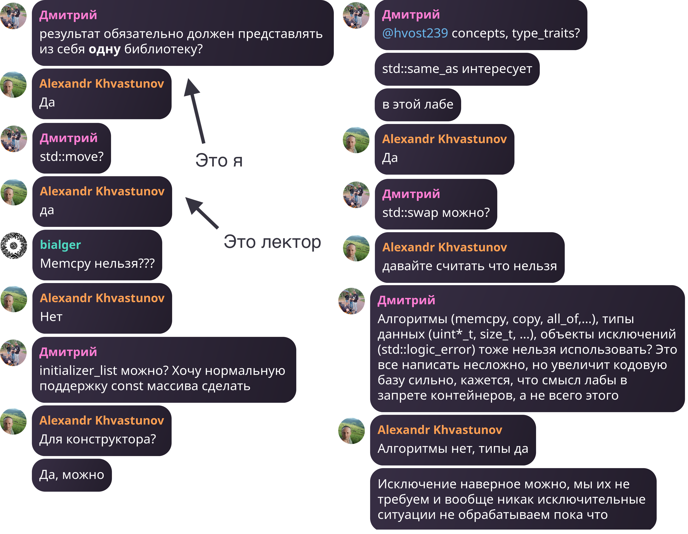

# Лабораторная работа 5
[]([https://github.com/elbruno/AzureApiBadge/actions/workflows/azure-static-web-apps-victorious-wave-00360790f.yml](https://github.com/is-itmo-c-23/labwork5-awakair/actions/workflows/gtest.yml))


## Задача

Спроектировать и реализовать класс для хранения трехмерного массива 17-битных положительных целых чисел.

## Требования

Ваша задача состоит в том, чтобы разработать класс, реализующий трехмерных массив и обладающий дополнительным набором свойств.

Пример использования:

```cpp
YourClassName arr = YourClassName::make_array(10, 2, 30);

arr[4][3][2] = 100500;
std::cout << arr[4][3][2];
```

В классе должены быть определены следующие операторы и методы:

- обращение к элементу массива за O(1) по времени и по памяти (реализация может использовать константный объем доп памяти, не зависящий от размера массива)
- операторы ввода и вывода
- умножение на число, где результат это новый массив
- сложение и вычитание двух массивов, где результат также является новым массивом (размеры по всем трем осям должны совпадать, в противном случае UB)
- [статический метод](https://en.cppreference.com/w/cpp/language/static) для создания массива, принимающий три положительных числа в качестве его размеров

## Реализация

1. Результат должен представлять из себя библиотеку
2. Ваш класс должен быть покрыт тестами, при этом в качестве фреймворка для написания тестов используется [GoogleTest](https://google.github.io/googletest/). Тесты также являются частью задания. Их полнота и покрытие - также оцениваются
3. Требуется внимательно следить за утечкам памяти

## Ограничения

1. Использование стандартной библиотеки помимо операторов ввода и вывода - запрещено <br/>
UPD: на самом деле, это не все
   
2. Ограничение по памяти на класс - (x * y * z * 17)/8 + const, где x, y, z - размер массива, const - некоторая константа

## Мое решение
- В файлах [uint17_view.h](src/uint17/uint17_view.h) и [uint17_view.cc](src/uint17/uint17_view.cc) содержится класс `UInt17View`,
которому передается указатель на начало трех байт и отступ (количество бит), он интерпретирует эти три байта как 17-битное неотрицательное число
- В файлах [array.h](src/uint17/array.h) и [array.cc](src/uint17/array.cc) содержится массив 17-битных чисел(`Array`), который просто аллоцирует нужное количество памяти,
при обращении по индексу создает и возвращает `UInt17View`. Т.е. работает по принципу `std::vector<bool>`
- В файле [array_view.h](src/uint17/array_view.h) содержится класс `ArrayView<Dimension, Container>`, который принимает в себя любой контейнер с определенными методами `size()` и `operator[](size_t)`
и представляет его память как n-мерный массив (`Dimension` - мерность, `Container` - тип массива) <br/>
Пример использования:
```cpp
std::vector<std::string> some_container = {"hello", "world", "some", "words"};
size_t offset = 0;
size_t height = 2;
size_t width = 2;
uint17::array_view<2, std::vector<std::string>> view(some_container, offset, height, width);
std::cout << view[0][0] << " " << view[0][1] << " " << view[1][0] << " " << view[1][1] << std::endl;
// hello world some words
```
Находится в `namespace uint17`, т.к. требовалась одна библиотека
- Все необходимые операторы реализует [наследник ArrayView](src/uint17/array_with_vectors_view.h)
